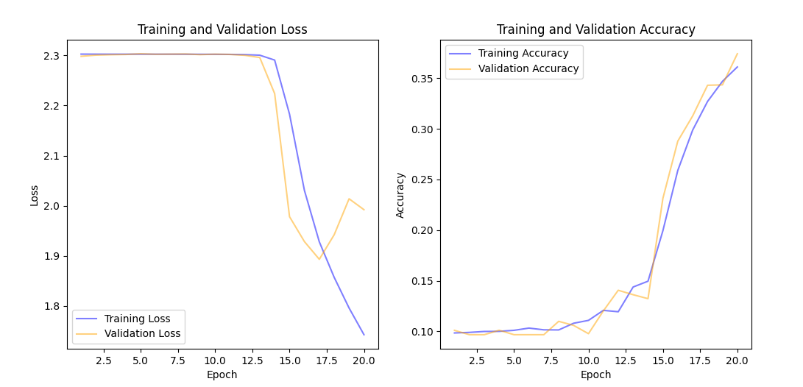
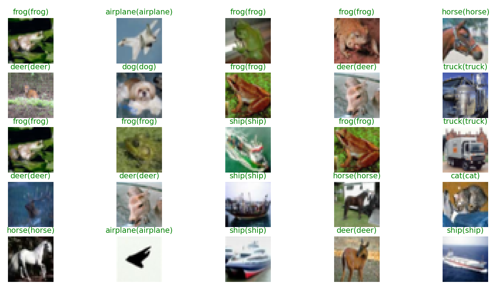

# 实验2
PB21061361韦睿鑫

### 网络框架
采用PyTorch作为神经网络框架。
### 数据搭建
首先使用`torchvision.datasets.CIFAR10`方法，参数`download=True`下载模型数据。设置`train=True`为训练集，`train=False`为测试集。
数据搭建在`DataLoad.py`中，通过使用`torch.Generator().manual_seed`方法固定选取一个随机种子，随后使用`torch.utils.data.random_split`方法将官方的训练集按4:1的比例划分为训练集和验证集。

### 模型搭建
模型搭建在`Convolutional.py`中，根据VGG模型以及查阅相关资料后，决定搭建模型采用6层卷积核和三层全连接层，具体示例图如下(每层右边的数字表示单个数据每个维度改变后的大小)：
.png>)
首先使用`nn.Conv2d`方法定义卷积核，卷积核大小为 $3\times 3$，随后使用ReLU函数激活，然后通过`BatchNorm2d`对卷积后的每个通道进行归一化。每重复两次之后使用`nn.Dropout`随机隐藏部分神经。如此重复6层卷积核，直到图片尺寸变为4*4，通道数变为256.
随后采用`nn.Flatten`方法，将256*4*4的三维数据转化为一维4096个特征的数据，并使用`nn.Linear`进行全连接，同时逐渐降低特征数，并在其中添加Dropout隐藏部分神经。最后当特征数为10时输出，对应10个分类。
模型处理完后，只需通过数据处理选择10个分类中概率最高的作为最终分类结果。

### 模型训练
在`run.py`中，将数据的batch size设为64。初始化卷积核大小$3\times 3$，填充`padding`大小为1，表示在图片周围1个像素区域填充0。Dropout初始设为0.3.
```py
model = ImagesClassifierModel(kernel_size=3, padding=1, dropout=0.3)
```
定义优化器为Adam.
```py
optimizer = torch.optim.Adam(model.parameters(), lr=learning_rate)
```
定义学习率控制器scheduler，采用自动检测方法，检测验证集上的损失值`val_losses`。具体做法是，当连续超过`patience=8`个epoch，`val_losses`不再减小至自身的0.99倍时（计算方式为`1-threshold`），学习率调整为自身的`factor=0.1`倍。这里学习率设置了下限$10^{-8}$，防止学习率过低。
```py
scheduler = torch.optim.lr_scheduler.ReduceLROnPlateau(optimizer, mode='min', factor=0.1, patience=8, 
                                                       threshold=0.01, threshold_mode='rel', cooldown=0, min_lr=0, eps=1e-08)
```
在`Model.py`中实现训练模型的基本步骤。首先定义训练的设备，如果GPU可以使用，则使用cuda技术，否则使用GPU。并将模型转移到对应的设备上，同时还需注意数据集也要转移到相应的设备，否则会引发设备不同的错误。
```py
device = torch.device('cuda' if torch.cuda.is_available() else 'cpu')
model = model.to(device)
```
然后训练模型，并在验证集上验证，画出loss曲线、learning rate曲线和准确率曲线（具体实现方法见`Plots.py`），记录模型参数并输出到`logs.txt`中。由于在单个GPU上进行一次训练需要花费10分钟左右，此处还添加了进度条库`tqdm`以便检测训练进度。其中损失函数使用交叉熵损失。
```py
criterion=nn.CrossEntropyLoss()
for epoch in range(num_epochs):
    # Set the model to training mode
    model.train()
    for inputs, labels in train_loader:
        inputs = inputs.to(device)
        labels = labels.to(device)

        # Zero the gradients
        optimizer.zero_grad()

        # Forward pass
        output = model(inputs)
        loss = criterion(output, labels)   
        loss.backward()
        optimizer.step()

        # 验证集上验证，步骤基本一致 
        validation(...)

        # Update learning rate if neccesary
        scheduler.step(val_losses_mean)
```
### 参数分析
#### Dropout
Dropout用于随机地隐藏一部分神经元，这样可以防止模型过度依赖任何一个神经元，从而提高模型的泛化能力。本次实验中使用的dropout起始值为0.3. 当dropout变小时，模型过拟合加重，准确率难以继续上升。dropout变大时，模型又过于欠拟合，导致模型的学习能力下降，准确率下降。如图所示，dropout=0.2时出现了较为严重的过拟合。

实验中过拟合的数据准确率与dropout的关系：
Dropout | 准确率(验证集)
-|-
0.1 | 0.75
0.2 | 0.78
0.3 | 0.85
0.4 | 0.83

除此之外，查阅一些资料发现，在全连接层附近增大dropout的值的效果更好。其原因可能是在此处模型的参数已经非常大，因此增大dropout的值可能会进一步减小大量参数的相互依赖关系，从而更有效避免过拟合。因此在本次实验中，在最后一层的卷积核以及全连接层的dropout在初始值上增加0.1至0.3。
#### BatchNorm
它的作用是对每个输入通道进行归一化。这样可以使得网络的每一层都能接收到类似的数据分布，提升准确率。
当没有使用归一化时，模型的表现效果非常差。只有37%~40%的准确率。其原因可能是各个特征的分布不统一，导致模型难以收敛。

只在最后的全连接层使用归一化时，模型的准确率上升，能够达到78%。
在每个卷积核之后使用归一化，准确率能够上升到85%。
#### Leanring rate decay
学习率没有调整时，容易出现loss曲线振荡无法继续收敛的问题，甚至继续上升导致过拟合。这是因为loss会在最小值附近振荡。

尝试学习率手动调整，每5个epoch下降为原来的0.2倍，此时loss曲线可以继续下降收敛，但是由于手动调整不能很好观察每次loss的变化情况，容易出现学习率某一区间过大过小的问题，导致模型性能不能继续上升，甚至无法收敛。


最后使用`torch.optim.lr_scheduler.ReduceLROnPlateau`方法，对验证集上的损失值`val_losses`进行检测。当其在连续`patience=8`个epoch不能有效下降时，尝试降低学习率。其效果较为显著，将正确率提高至85%。

#### 卷积核大小与模型深度
卷积核不宜较大，实际上在使用$5\times 5$的卷积核时，性能进一步受限。若不使用填充技术，在使用大卷积核之后，图像尺寸下降的速度较快，导致模型深度不能太深。准确率只有80%左右。
为了保持模型深度，需要将填充层加至2，此时能达到84%的准确率。

如果使用$7\times 7$的模型的卷积核，填充为3时，模型的准确率开始下降至82%。可见加入了一些无关信息后，即使保持深度不变，也会导致准确率下降。
### 测试
最后选用卷积核为$3\times 3$，填充为1，训练60个epoch，Dropout初始为0.3、随后分别是0.4、0.4、0.5、0.6，如模型搭建图所示。学习率采用自动调整。得到如下损失函数图、正确率图和学习率变化图。

得到的测试集上的分类图标如图，在测试集上的准确率是85.16%。

取出一些图片的真实标签和预测标签如图.


#### 参考资料
https://www.kaggle.com/code/faressayah/cifar-10-images-classification-using-cnns-88
https://www.kaggle.com/code/shadabhussain/cifar-10-cnn-using-pytorch
https://pytorch.org/tutorials/beginner/blitz/cifar10_tutorial.html

