# 实验1
PB21061361韦睿鑫
### 网络框架
采用PyTorch作为神经网络框架。
### 数据生成
使用numpy，在x和y上生成`Num_SampleSize`个数据点，使得
$$ y = \log_2(x) + \cos(\pi x/2), x\in [1,16]$$随后，对`Num_SampleSize`个索引index进行打乱。例如`Num_SampleSize = 200`时，生成的200组数据$x[0..199]$与$y[0..199]$的索引进行打乱后，按照$8:1:1$的分类划分为训练集，验证集和测试集。随后将这些数据存储至`data`文件夹中。
```py
import numpy

def Generate_dataset(Num_SampleSize):
    x = numpy.linspace(1, 16, Num_SampleSize)
    y = numpy.log2(x) + numpy.cos(numpy.pi * x / 2)
    x = torch.Tensor(x).view(-1, 1)
    y = torch.Tensor(y).view(-1, 1)

    # 划分
    set = torch.randperm(Num_SampleSize)
    train_set = set[:int(Num_SampleSize*0.8)]
    val_set = set[int(Num_SampleSize*0.8):int(Num_SampleSize*0.9)]
    test_set = set[int(Num_SampleSize*0.9):]

    x_train, y_train = x[train_set], y[train_set]
    x_val, y_val = x[val_set], y[val_set]
    x_test, y_test = x[test_set], y[test_set]
```
当训练、测试或验证时，从存储的地方读出数据，并转化为TensorDataset，随后使用DataLoader对数据集划分为batch，方便分批次的训练。

### 模型搭建
采用PyTorch，激活函数使用ReLU或Sigmoid。定义网络深度`num_hidden_layers`，其中每一层为一个线性层和非线性层的包装。
```py
import numpy as np
import torch.nn as nn
class Feed_Forward_Network(nn.Module):
    def __init__(self, input_size, hidden_size, output_size, num_hidden_layers):
        super(Feed_Forward_Network, self).__init__()
        # self.fully_connected1 = nn.Linear(input_size, hidden_size, dtype=torch.float64)
        self.relu = nn.ReLU()
        self.sigmoid = nn.Sigmoid()

        self.hidden_layers = nn.ModuleList()
        self.hidden_layers.append(nn.Linear(input_size, hidden_size))
        for _ in range(num_hidden_layers - 1):
            self.hidden_layers.append(nn.Linear(hidden_size, hidden_size))
        self.fully_connected2 = nn.Linear(hidden_size, output_size)

    def forward(self, x):
        # out = self.fully_connected1(x)
        out = x
        for layer in self.hidden_layers:
            #out = self.relu(layer(out))
            out = self.sigmoid(layer(out))
        out = self.fully_connected2(out)
        return out
```
### 模型训练
定义`input_size=1, output_size=1`，对模型在训练集上进行训练。训练过程中使用MSE作为loss function，其定义为
$$MSE = \frac{1}{n}\sum_{i=1}^n (\hat{y_i} - y_i)^2 $$并使用Adam作为optimizer。训练时通过搭建好的模型进行前向的loss计算和反向的梯度传播，并用优化器更新参数，从而训练模型。在每个epoch后再验证集上进行验证并计算loss，以得到loss-epoch的关系图。
```py
model = Feed_Forward_Network(input_size, hidden_size, output_size, num_hidden_layers)
criterion = nn.MSELoss()
optimizer = torch.optim.Adam(model.parameters(), lr=leaning_rate)

# train
for epoch in range(num_epoch):
    for input, target in train_loader:
        output = model.forward(input)
        loss = criterion(output, target)

        optimizer.zero_grad()
        loss.backward()
        optimizer.step()
    with torch.no_grad():
        val_losses = []
        x_val = []
        y_val = []
        y_pred = []
        for input, target in val_loader:
            x_val.append(input.numpy())
            y_val.append(target.numpy())
            val_output = model(input)
            y_pred.append(val_output.numpy())
            val_loss = criterion(val_output, target)
            val_losses.append(val_loss.item())
        val_MSE_mean = np.mean(val_losses)
        val_MSE_set.append(val_MSE_mean)
```
### 调参分析
使用MSE作为性能指标，分析网络参数的影响。这里以$N=200$为例。默认时，取epoch=800, batchsize=64, 学习率=0.002，宽度=64，深度=5. 激活函数默认为sigmoid。
#### 网络深度
网络深度的提升能够提升神经网络的预测能力。当网络深度为1时，此时神经网络几乎没有预测能力。神经网络并不能预测出原来的曲线
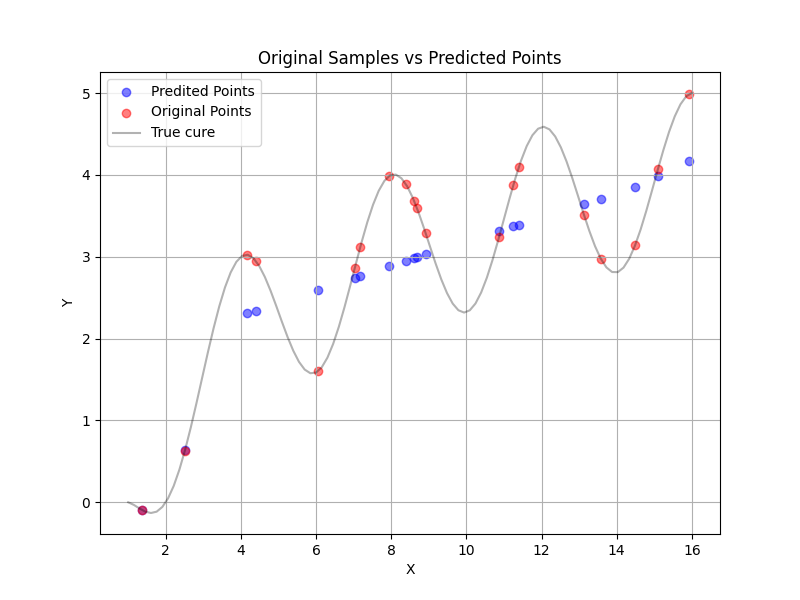
对于默认情况，深度增加时MSE逐渐减少：
深度|MSE
-|-
1|0.417
2|0.405
3|0.319
4|0.158
5|0.013

可以看出，当深度=5时，此时的MSE已经来到0.01左右，此时拟合的效果也已经比较明显。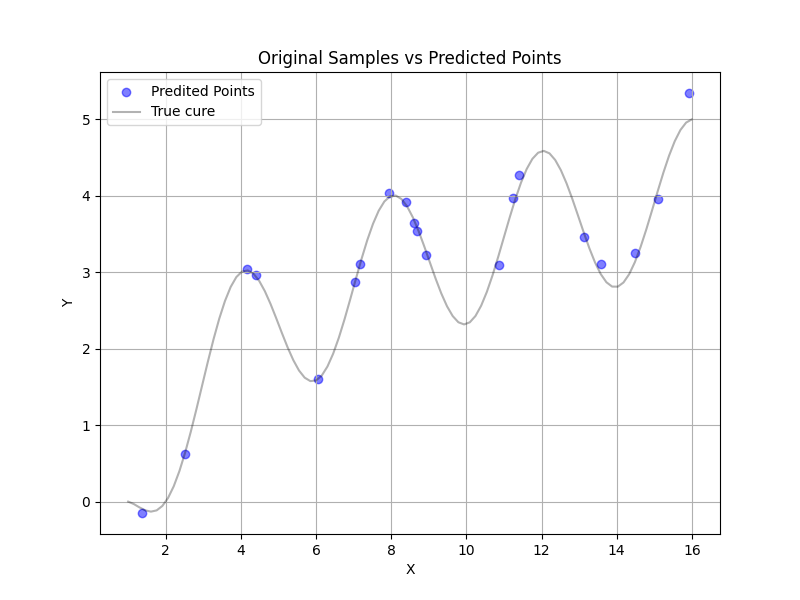

### 学习率
学习率能够影响梯度下降的速度，进而影响loss减少的速度。在固定其他参数和样本时，以下是取上述默认情况（取epoch=800, batchsize=64, 学习率=0.002，宽度=64，深度=5.）时，学习率改变发生的MSE变化。
学习率|MSE
-|-
0.001|0.365
0.002|0.013
0.004|0.00047
0.008|0.003
0.015|0.009(振荡)

学习率较小时，梯度下降的速度过慢，导致在epoch结束时，MSE的收敛速度太慢。造成结束时MSE太大。
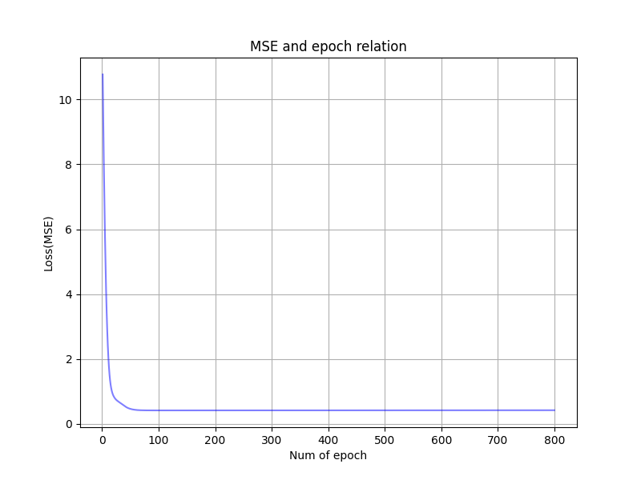
而学习率太大时，MSE开始出现了振荡。此时模型在最优解附近来回震荡，导致训练过程不稳定。
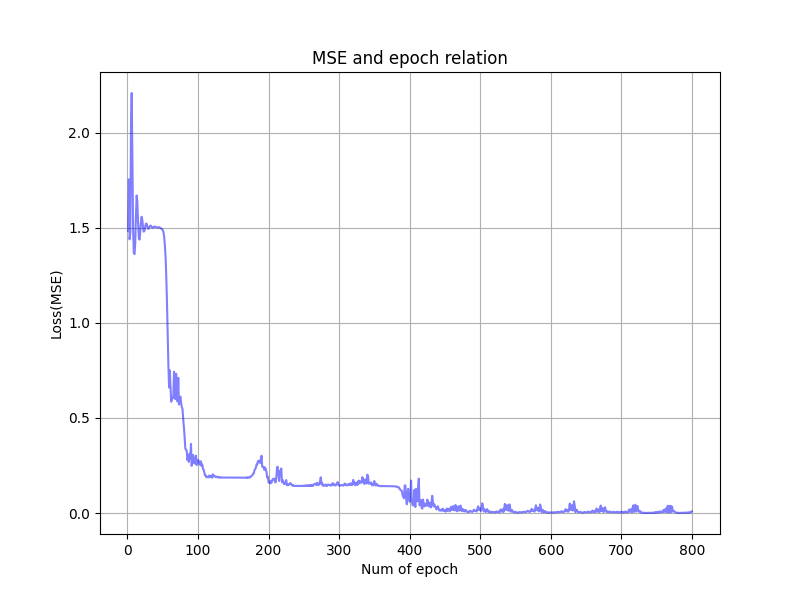

### 网络宽度
网络宽度影响着网络的学习能力。默认情况（取epoch=800, batchsize=64, 学习率=0.002，宽度=64，深度=5.），更改网络宽度得到MSE如下：=
网络宽度|MSE
-|-
16|0.243
32|0.290
48|0.186
64|0.148
96|0.006
128|$7.25\times 10^{-5}$
512|0.011

可见网络宽度增大时，模型的学习能力增强了，MSE在逐渐减小。但网络宽度也不是越大越好，如果网络宽度太大，可能会出现振荡导致模型性能下降，并且大大增加训练所耗费的时间。如宽度为512时开始观察到部分振荡。
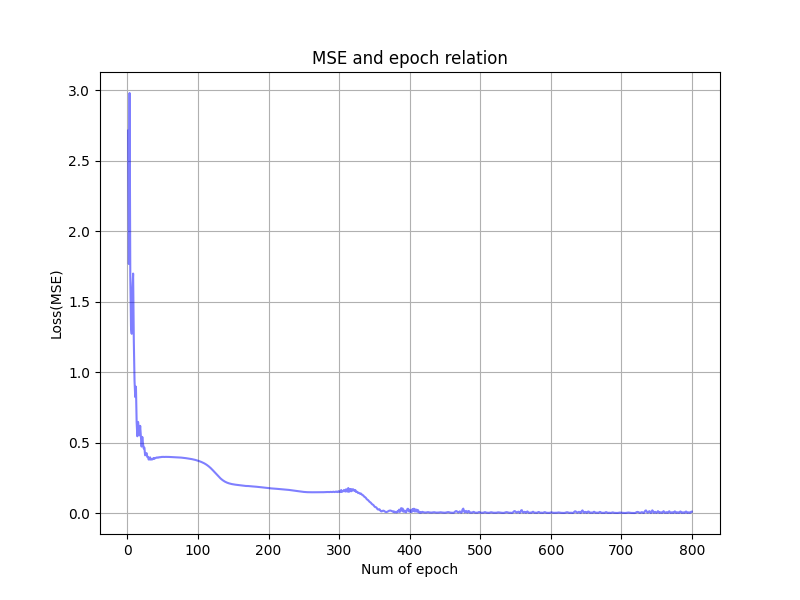

### 激活函数
本次测试了4个激活函数。分别为ReLU，Sigmoid函数，tanh函数和leakyrelu函数，定义分别为
$$ReLU = \max(0,x) $$ $$Sigmoid=\frac{1}{1+e^{-x}} $$$$\tanh(x) = \frac{e^x - e^{-x}}{e^x + e^{-x}}$$ $$ LeakyReLU = \begin{cases}
    x, x>0\\ ax, x\leq 0
\end{cases} $$
默认取$a=0.01$。
对于默认的参数时，ReLU的表现不如Sigmoid的表现好。
MSE|ReLU|Sigmoid|Tanh|LeakyReLU
-|-|-|-|-|
-|0.08|0.01|0.0003|0.38

可以看出，Sigmoid和Tanh表现较好，LeakyReLU无法收敛，ReLU则收敛太慢。但是在Tanh的loss曲线中看到了少许振荡现象:
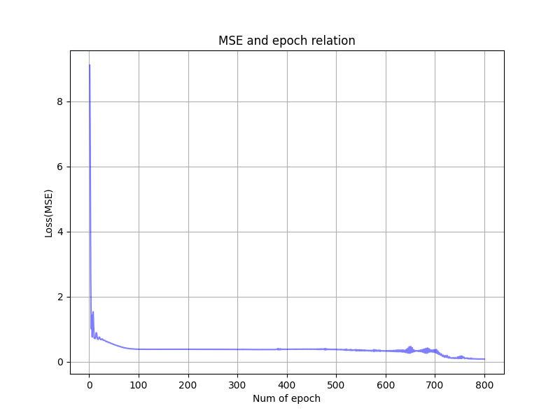

换一组参数，取epoch=600, batchsize=64, 学习率=0.0015，宽度=96，深度=5. 此时增加了深度，略微降低了学习率、epoch。
MSE|ReLU|Sigmoid|Tanh|LeakyReLU
-|-|-|-|-|
-|0.195|0.002|0.00044|0.005

可见，对于不同的参数，选择合适的模型也比较重要。此时sigmoid、Tanh和LeakyReLU的MSE 都比较小，但ReLU出现了振荡的问题。


### 测试集测试
输入以下指令即可测试。
```
python run.py --test
```
$N=200$时，取宽度=128，epoch=800，学习率=0.002，深度=5，使用sigmoid函数，得到验证集MSE=0.002，测试集上测试MSE=0.00058，得到验证集loss曲线和测试集的拟合情况：
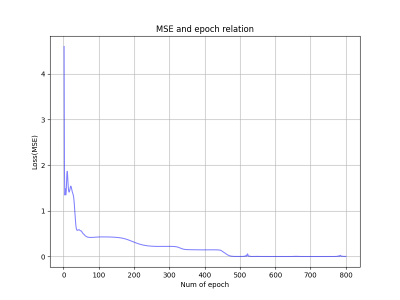
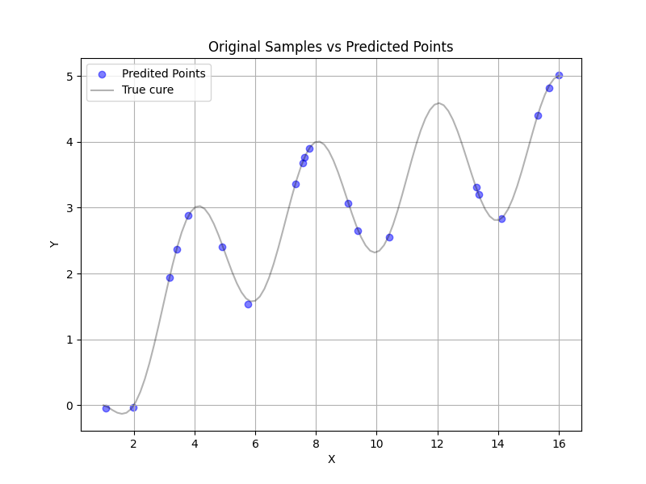

$N=2000$时，取宽度=64，epoch=200，学习率=0.002，深度=5，使用sigmoid函数，得到验证集MSE=0.0024，测试集上测试MSE=0.0034，得到验证集loss曲线和测试集的拟合情况：
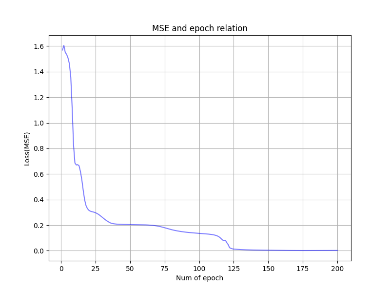
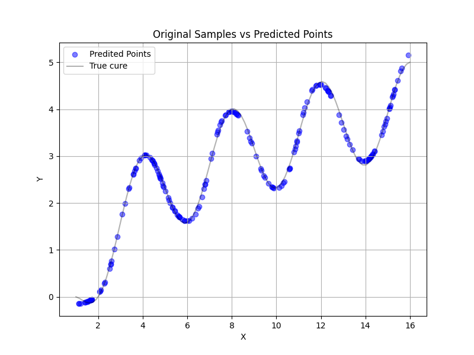

$N=10000$时，取宽度=64，epoch=150，学习率=0.001，深度=5，使用sigmoid函数，得到验证集MSE=0.00036，测试集MSE=$8.64\times 10^{-5}$，得到验证集loss曲线和测试集的拟合情况：
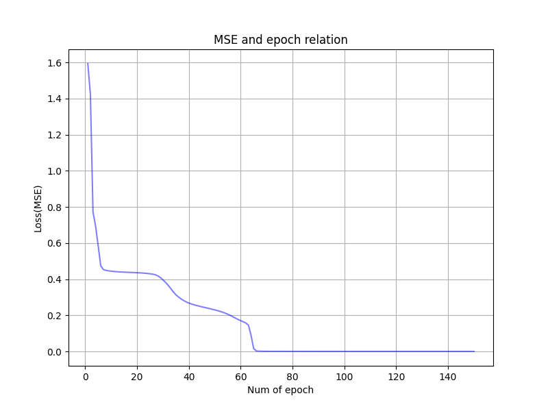
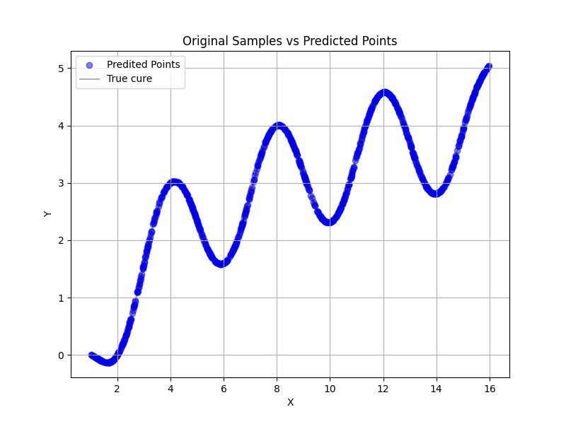

### 文件分布
`src/NumGenerate.py`用于生成数据，直接运行即可。
`src/run.py`用于运行模型，直接而运行即可。